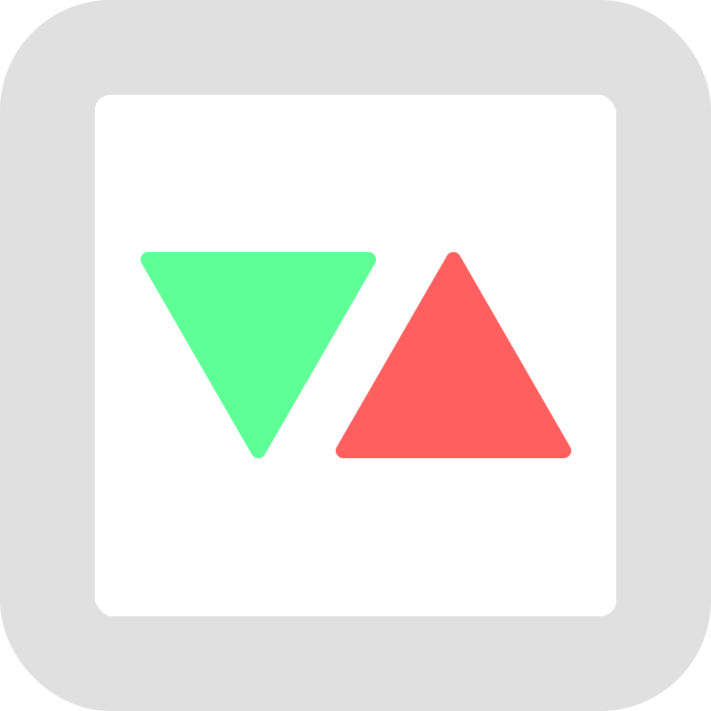

# MultiPlay Core, Alpha!

Create Godot Multiplayer games ready for network, local play and more!

[Documentation](https://mpc.himaji.xyz/docs) • [AssetLib](https://godotengine.org/asset-library/asset/2889)

MultiPlay Core is a **Godot Multiplayer Framework**. Designed to make multiplayer easier, and meet user’s preferences on multiplayer games! Some of the key features include:

- Multiple play mode with minimal code.
- Simplified API for general-purpose uses.
- Allow for user data when joining in.

## License

Multiplay Core is licensed under The MIT License, free of charge. Do whatever!

Built with 💖 by maji.
